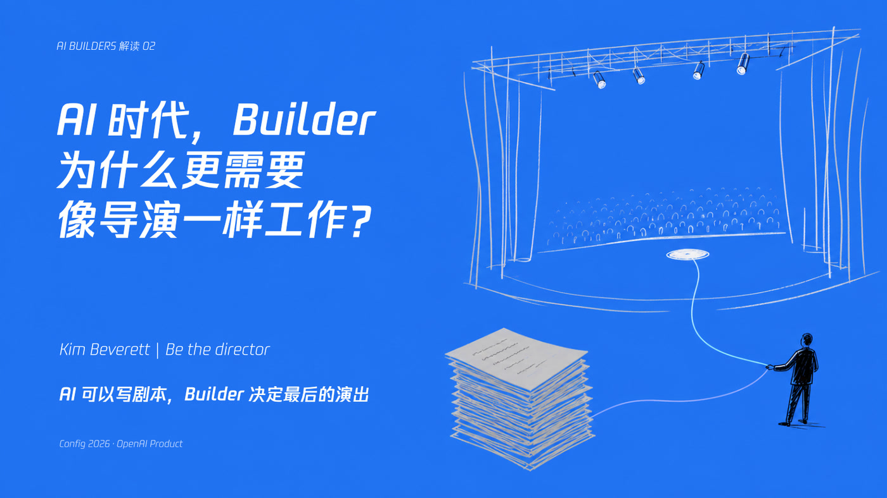
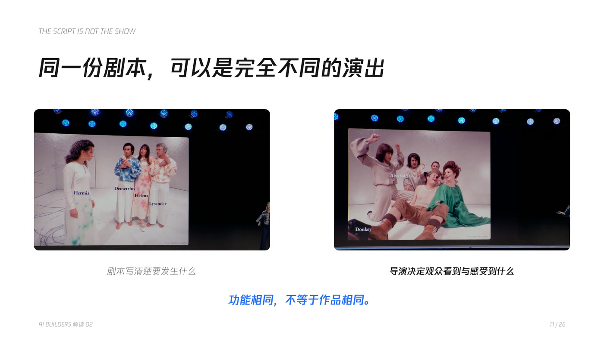
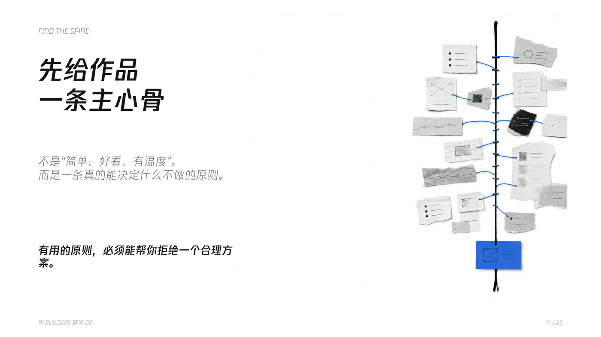
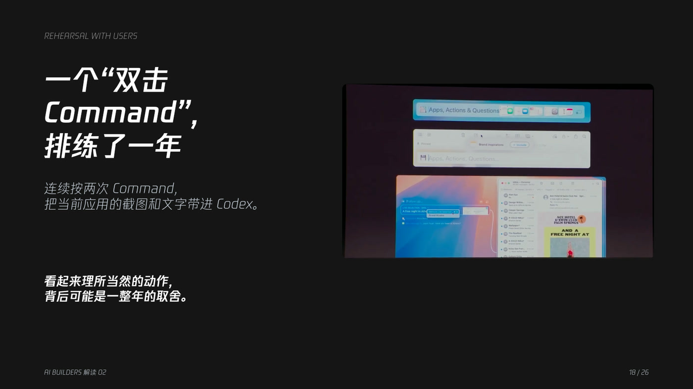
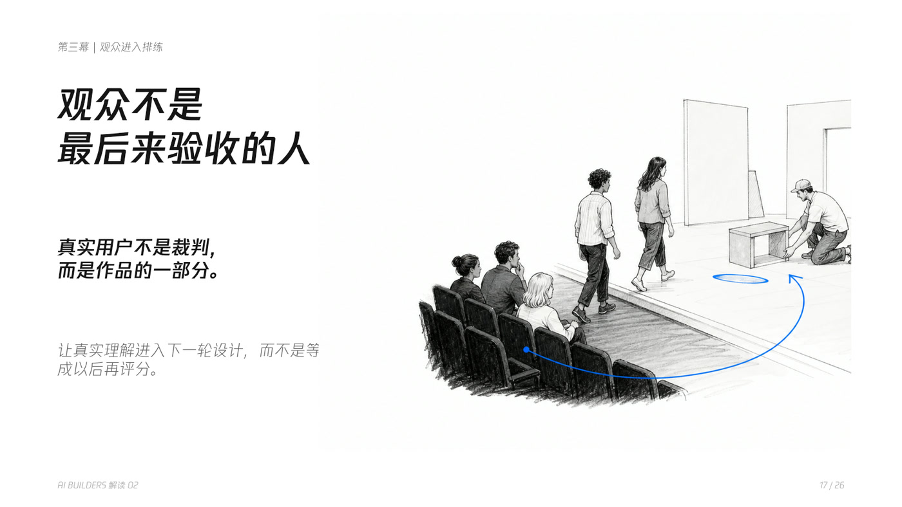
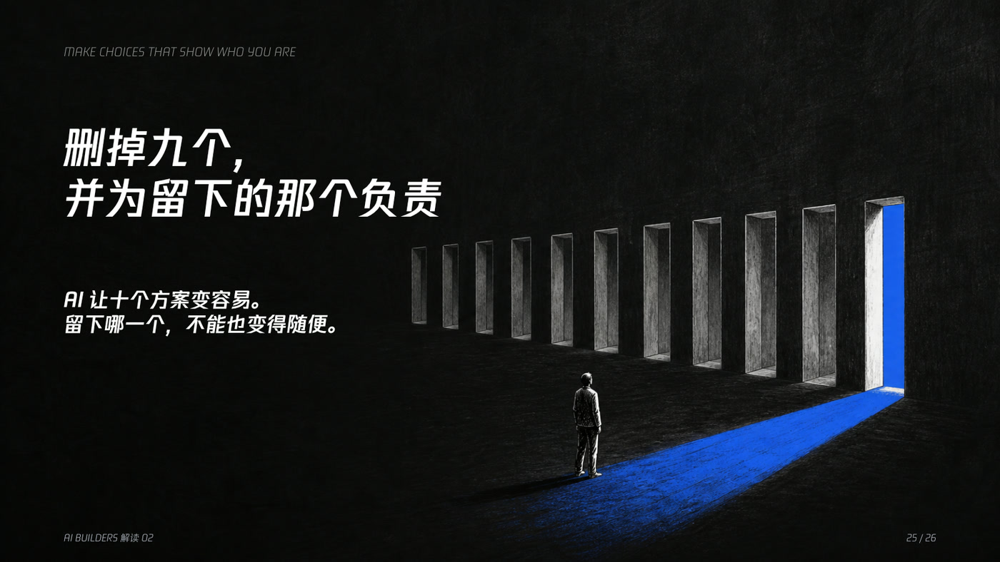

<div align="center">

<sub>ELISEDAI · PERSONAL PPT SKILL</sub>

# EliseDai Personal Style PPT

**把逐字稿、文章、大纲或旧 PPT，变成文字主导、黑白鲜曜蓝、真正适合讲述的 AI-native 演示文稿。**

<p>
  <a href="https://agentskills.io/"></a>
  
  
  
</p>



<p>
  <a href="skills/elisedai-personal-style-ppt/SKILL.md"><strong>查看 Skill</strong></a>
  &nbsp;·&nbsp;
  <a href="#真实案例ai-builders-解读-02">查看真实案例</a>
  &nbsp;·&nbsp;
  <a href="#安装">安装</a>
  &nbsp;·&nbsp;
  <a href="#关于创作者">Elisedai在创造</a>
</p>

</div>

---

很多 AI 生成的 PPT 看起来完整，却更像自动排版的报告：卡片很多、颜色很多、截图被塞进矩形框，插图与观点没有关系，每一页也缺少真正能说出口的判断。

这个 Skill 固定的不是页面模板，而是一套个人判断：**一页只讲一个观点，蓝色承担意义，截图保留证据，配图推进叙事。**

## 你会得到什么

| 01 · 讲清楚 | 02 · 建立个人视觉 | 03 · 让图片真正融入 |
| :--- | :--- | :--- |
| 从材料中提炼一条累计推进的叙事主线，每页只保留一个观点 | 固定使用黑、白、灰和鲜曜蓝 `#276EF1`，用白场、黑场、蓝场控制节奏 | 区分截图、照片、证据与隐喻，通过裁切、比例、留白和解释统一素材 |
| **结果：** 可以直接讲出来的标题与页面顺序 | **结果：** 风格一致但不重复模板的可编辑 PPT | **结果：** 截图不失真，配图不突兀，也不只剩全蓝简笔画 |

最终输出不是一套“每页都长得一样”的模板，而是一份：**观点清楚、视觉克制、截图可信、配图有意义的讲述型演示文稿。**

## 30 秒开始

把逐字稿、文章、大纲或已有 PPT 交给 Agent：

```text
使用 $elisedai-personal-style-ppt，把这份内容做成一套 16:9 的讲述型 PPT。
文字使用黑白灰，背景只用白、黑和鲜曜蓝；截图保持完整可读，配图根据观点选择，不要重复一种形式。
```

Skill 会先确定观众最后应该理解什么，再选择每一页的画布、视觉角色与图片处理方式，不会先套模板再塞内容。

## 真实案例：AI Builders 解读 02

案例主题：**AI 能生成十个方案以后，Builder 为什么要删掉九个？**

输入是一份围绕舞台导演、AI 产品构建与选择判断展开的解读逐字稿，同时包含演讲截图、产品界面和抽象观点。Skill 将它收敛成一条主线：

> AI 可以更快地产生选项，但 Builder 的价值，是找到作品的主心骨，决定最后留下什么。

<table>
  <tr>
    <td width="50%" valign="top">
      <strong>截图作为证据</strong><br><br>
      <br>
      保留原始画面比例和可读区域，通过一致尺寸、留白、标题和注释建立比较关系。
    </td>
    <td width="50%" valign="top">
      <strong>抽象观点变成视觉隐喻</strong><br><br>
      <br>
      用一条贯穿材料的蓝色脊柱表达“作品主心骨”，而不是再做一张流程图。
    </td>
  </tr>
  <tr>
    <td width="50%" valign="top">
      <strong>黑场为截图提供舞台</strong><br><br>
      <br>
      产品截图保持原有界面颜色；统一感来自裁切、比例、位置与舞台关系，不来自强制改色。
    </td>
    <td width="50%" valign="top">
      <strong>人物与空间共同讲故事</strong><br><br>
      <br>
      用人物、空间和一条蓝色路径表达观众如何进入作品，避免解释卡片堆叠。
    </td>
  </tr>
  <tr>
    <td width="50%" valign="top">
      <strong>结论变成一个动作</strong><br><br>
      <br>
      一排被淘汰的方案和唯一蓝色出口，直接承担“删掉九个”的判断。
    </td>
    <td width="50%" valign="top">
      <strong>结尾回答开头</strong><br><br>
      <br>
      回到开场的舞台隐喻：AI 可以加快写剧本，Builder 决定最后的演出。
    </td>
  </tr>
</table>

## Skill 如何做选择

| 当前内容 | 优先选择 | 不应该做什么 |
| --- | --- | --- |
| 核心问题、转折或最终结论 | 鲜曜蓝全场，白色文字与线条 | 给普通内容随意加蓝色背景 |
| 解释、比较、截图与证据 | 白场，黑灰文字，蓝色只标示关系 | 把截图放进彩色卡片或缩得不可读 |
| 张力、限制、未知空间或决定性判断 | 黑场或白页中的黑色舞台 | 连续多页使用相同黑底模板 |
| 真实 UI、图表、人物或现场照片 | 保留原色，先统一裁切、比例与留白 | 为了风格统一而强制灰度或全蓝 |
| 抽象概念 | 手绘隐喻、几何舞台、全场景插图 | 用通用图标重复标题字面意思 |
| 一组同角色图片 | 相同可见尺寸、圆角、间距和标题基线 | 只统一外框，不统一实际可见内容 |

### 固定的个人语言

- 全页背景只使用纯白 `#FFFFFF`、黑色 `#151515` 或鲜曜蓝 `#276EF1`。
- 普通文字只使用黑、白和灰，不把关键词随意染蓝。
- 一页一个观点、一个视觉意图，普通页面不超过两层可见文字。
- 蓝色只承担一个语义角色：路径、光、行动、变化、结果或整页场域。
- 腾讯体优先，标题使用 W7，正文、英文和数字使用 W3。
- 页面可以变化，但边距、标题基线、图片尺度、说明文字和页码位置保持稳定。

## 截图与配图边界

| 图片角色 | 处理原则 |
| --- | --- |
| **Evidence** · 截图、界面、图表 | 优先保持原色、比例和完整信息；看不清时先放大或减少截图数量 |
| **Context** · 人物、场景、来源 | 通过裁切、留白和位置融入页面，不改变事实含义 |
| **Metaphor** · 抽象观点 | 围绕当前观点生成专属视觉，不复用通用图标或参考图 |
| **Atmosphere** · 情绪、空间 | 可以使用灰度、浅蓝或双色处理，但不能伪装成证据 |

建议型视觉 Hook 会提醒截图太小、裁切失真、连续多页只使用截图、蓝色沦为装饰、同组图片尺寸不一致或字体发生替换。Hook 不会代替设计判断，也不会强制阻断交付。

## 安装

核心 Skill 位于 [`skills/elisedai-personal-style-ppt`](skills/elisedai-personal-style-ppt)。请复制整个目录，而不是只复制 `SKILL.md`，否则 Agent 无法读取视觉系统、截图规则、图片提示词和 Hook。

<details>
<summary><strong>查看不同 Agent 的安装方式</strong></summary>

| 使用环境 | 安装位置 | 调用方式 |
| --- | --- | --- |
| 开放 Agent Skills | `.agents/skills/elisedai-personal-style-ppt/` | 自然语言或点名 Skill |
| Claude Code | `~/.claude/skills/elisedai-personal-style-ppt/` 或项目内 `.claude/skills/` | `/elisedai-personal-style-ppt` |
| OpenAI Codex | `~/.codex/skills/elisedai-personal-style-ppt/` | `$elisedai-personal-style-ppt` |
| 其他 Agent | 将整个目录加入 Agent 可读取的上下文 | 要求先读取 `SKILL.md` |

在 Codex 中也可以直接说：

```text
请使用 $skill-installer 安装这个 Skill：
https://github.com/Elisedai1013/elisedai-personal-style-ppt-skill/tree/main/skills/elisedai-personal-style-ppt
```

</details>

## 使用示例

<details>
<summary><strong>从逐字稿或文章生成新 PPT</strong></summary>

```text
使用 $elisedai-personal-style-ppt，把这份逐字稿做成一套 16:9 的 AI-native 讲述型 PPT。
先提炼叙事主线，再决定每页用白场、黑场还是蓝场；为抽象观点生成配图。
```

</details>

<details>
<summary><strong>优化已有 PPT</strong></summary>

```text
使用 $elisedai-personal-style-ppt，保留现有内容、截图和事实，把这份 PPT 改成 EliseDai 个人风格。
不要覆盖原文件，完成后渲染全部页面并逐页检查。
```

</details>

<details>
<summary><strong>处理截图很多的 PPT</strong></summary>

```text
使用 $elisedai-personal-style-ppt 优化这份截图型 PPT。
截图不要强制改色，先保证完整、可读和不失真；同组截图统一可见尺寸、裁切、间距和说明文字。
```

</details>

## 字体说明

视觉系统优先使用 `TencentSans W7` 和 `TencentSans W3`。腾讯字体文件没有包含在公开仓库中，请使用已经获得授权的本地字体。

如果运行环境没有腾讯体，Skill 会建议使用 Source Han Sans SC 或 Noto Sans CJK SC，并在交付时说明字体替换。字体存在于本机也不等于已经嵌入 PPTX；需要通过最终文件结构和桌面 PowerPoint 再次确认。

## 关于创作者

<table>
  <tr>
    <td width="230" align="center">
      
    </td>
    <td>
      <h3>Elisedai在创造</h3>
      <p>关注全球 AI Builders，分享我的思考，以及正在创造的产品与工具。</p>
      <p><strong>扫码关注微信视频号 · 看 AI-native PPT 如何服务真正的表达</strong></p>
    </td>
  </tr>
</table>

<details>
<summary><strong>仓库结构</strong></summary>

```text
assets/                                      # README 创作者素材
examples/episode-02/                         # 第二期真实 PPT 示例
skills/elisedai-personal-style-ppt/
├── SKILL.md                                 # 触发条件、工作流与非协商规则
├── agents/openai.yaml                       # Codex 展示信息
├── assets/                                  # 风格参考 PPT 与预览图
├── references/
│   ├── style-system.md                      # 色彩、字体、布局与视觉语法
│   ├── slide-archetypes.md                  # 页面原型及使用场景
│   ├── image-prompts.md                     # 配图生成与编辑提示词
│   ├── screenshot-integrity.md              # 截图完整性与融合规则
│   └── font-compatibility.md                # 字体兼容与交付边界
└── scripts/
    ├── treat_photo.py                       # 照片和截图处理
    └── visual_quality_hook.py                # 建议型视觉质量 Hook
```

</details>

## 使用与授权说明

第二期图片用于展示这个 Skill 的真实输出，不是需要逐页复制的模板。公开仓库不包含腾讯字体二进制或第三方 Claude 参考截图。

本仓库当前未附加开源许可证。复制、修改或再分发前，请先获得仓库作者许可。

---

<div align="center">
  <sub>EliseDai Personal Style PPT · Make every slide carry one idea.</sub>
</div>

