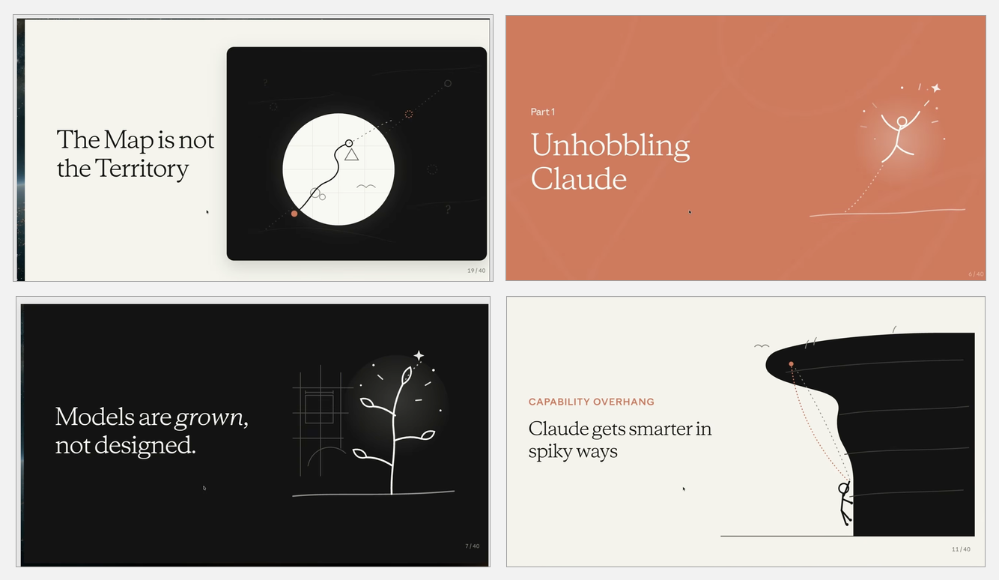

# EliseDai Personal Style PPT Skill

一个具有 EliseDai 个人视觉语言的 AI-native PPT Skill：文字主导，固定使用黑、白、灰与鲜曜蓝 `#276EF1`，结合腾讯体层级、简约概念配图、完整截图融合和建议型视觉 Hook。

## 适合什么场景

- 从逐字稿、文章或大纲生成演示文稿
- 把已有 PPT 改成黑白鲜曜蓝的编辑式风格
- 统一截图、照片和混合来源素材
- 生成文字主导、配图简约但不单调的 AI-native 讲述型 PPT

## 安装

将 `skills/elisedai-personal-style-ppt` 复制到你的 Skills 目录，或通过支持 GitHub Skill 安装的平台导入本仓库。

使用时可以说：

> 使用 `$elisedai-personal-style-ppt`，把这份内容做成 EliseDai 个人风格的 PPT。

## 字体说明

视觉系统优先使用 `TencentSans W7` 和 `TencentSans W3`。腾讯字体文件未包含在公开仓库中；请使用已获得授权的本地字体。字体不可用时，Skill 会建议使用 Source Han Sans SC 或 Noto Sans CJK SC 作为兼容方案。

## 主要能力

- 黑白灰＋鲜曜蓝的稳定色彩系统
- 腾讯体优先的中英文排版层级
- 白场、蓝场和黑场三种叙事画布
- 手绘隐喻、几何舞台、全场景插图与图片窗口
- 截图完整性、等比例裁切和证据可读性检查
- 照片与截图的确定性处理脚本
- 非阻断式视觉质量 Hook

